# Axon-Lang: Convergencia Teórica — Síntesis de Investigaciones

> **Documento de Concertación**  
> Fusión de la investigación filosófico-cognitiva (neuro_axon.md) con la investigación técnico-académica (academic_research_axon_features.md).  
> Cada sección establece un **Teorema de Convergencia** que conecta el fundamento filosófico con la especificación técnica, produciendo una directiva de diseño accionable para axon-lang.

---

## Tabla de Convergencias

| # | Dimensión | Fundamento Filosófico (neuro_axon) | Fundamento Técnico (academic_research) | Primitiva Axon Resultante |
|---|-----------|-------------------------------------|---------------------------------------|--------------------------|
| 1 | Streaming Semántico | Co-inducción + lattice epistémico doxástico | Coinductive types (Jacobs & Rutten) + gradual types (Siek & Taha) | `stream<τ>` con epistemic gradient |
| 2 | Function-Calling | Efectos algebraicos como «intención computacional» | Plotkin & Pretnar handlers + Pangolin selection monads | `effect ToolCall` + `handler` |
| 3 | Tool FFI | Contratos de orden superior + blame bimodal | Findler & Felleisen contracts + Indy blame semantics | `@contract_tool` bridge |
| 4 | Decoradores | Metaprogramación CSP + verificación híbrida | Design by Contract (Meyer) + contract generation pipeline | `@csp_tool` decorator → CSP |
| 5 | Conversación Multi-Turno | Coálgebras cíclicas + dualidad de polaridad | Session types (Honda, Yoshida, Carbone) | `session<Protocol>` |
| 6 | Composabilidad Modular | Módulos ML + compilación separada | ML-style module systems + namespace hygiene | `module` + separate compilation |
| 7 | Multi-Model Dispatch | Capability types + inyección paramétrica | Koka row types + parametric effects | `effect Model[B]` per-step |
| 8 | Context Window | Lógica lineal de Girard + tipos afines | Linear logic (Girard 1987) + resource-aware types | `Budget(n)` linear type |

---

## 1. Streaming Semántico: La Convergencia Coinductiva-Epistémica

### Tesis Filosófica (neuro_axon §1)

> Un stream generativo no es una lista estática sino un elemento del **mayor punto fijo** de un functor polinómico. La evaluación de propiedades de seguridad (shields, taint) sobre un stream en vivo exige una **semántica co-inductiva estricta** donde la propiedad se mantiene para la cabeza actual y, recursivamente, para el «resto» del stream.

La nomenclatura epistémica establece que durante streaming, toda aserción posee irrevocablemente el tipo `believe`. La transición a `know` exige tres condiciones concurrentes:
1. El stream converge (respuesta completa)
2. Un anchor valida el contenido contra fuente de verdad
3. Todos los contratos de validación se satisfacen

### Tesis Técnica (academic_research §1)

Los coinductive types (Jacobs & Rutten, 1997) modelan streams como `νX. StreamChunk × X` (greatest fixed point). El tipo epistémico es **gradual** (Siek & Taha, 2006): empieza en `⊥` y asciende conforme llegan chunks. La bisimulación (Milner, 1989) provee equivalencia semántica de streams independiente de chunking.

### ⟹ Teorema de Convergencia 1: Gradiente Epistémico Coinductivo

```
Stream(τ) = νX. (StreamChunk × EpistemicState × X)

donde EpistemicState ∈ {⊥, doubt, speculate, believe, know}
y la transición es monotónica: ⊥ ⊑ doubt ⊑ speculate ⊑ believe ⊑ know
```

**Resolución unificada:**

| Propiedad | Filosofía aporta | Técnica aporta | Diseño resultante |
|-----------|-----------------|----------------|-------------------|
| Tipo del chunk parcial | `believe` — doxástico, sin axioma T | Gradual type `?` (Siek & Taha) | `EpistemicGradient<τ>` que asciende el lattice |
| Evaluación de shields | Co-inductiva: seguridad sobre cabeza + cola | Bisimulación: equivalencia observacional | Shield evalúa co-inductivamente cada chunk |
| Convergencia | 3 condiciones: completude + anchor + contratos | Greatest fixed point + Knaster-Tarski | Transición `believe→know` es un **colímite** en el lattice |
| Backpressure | Budget cognitivo como recurso finito | Flecha lineal `⊸` (Girard) | `Budget(n) ⊸ Stream(τ) → (Chunk × Budget(n-1))` |

**Directiva de diseño para axon:**

```axon
stream<Diagnosis> {
  epistemic_gradient: doubt → speculate → believe → know
  
  on_chunk(chunk) {
    -- Cada chunk vive en EpistemicGradient
    -- Shield evalúa co-inductivamente
    shield.scan_incremental(chunk)
  }
  
  on_complete(full_response) {
    -- Solo aquí se intenta promoción a know
    if anchor.validate(full_response) and contracts.satisfied():
      promote(believe → know)
  }
}
```

---

## 2. Function-Calling: Separación Intención-Ejecución via Efectos Algebraicos

### Tesis Filosófica (neuro_axon §2)

> Una llamada a herramienta por parte de un agente no es una mutación directa del mundo, sino que representa una **«intención computacional»**. El modelo neuronal emite una *sugerencia de acción*, no un mandato de ejecución nativa. 

La superioridad de los efectos algebraicos (Plotkin & Pretnar) sobre la I/O monádica de Haskell reside en:
- Los transformadores de mónadas producen firmas excesivamente rígidas que chocan con el comportamiento estocástico multi-ruta de los LLMs
- Los efectos algebraicos reifican el **árbol completo de continuaciones**, permitiendo trazar dependencias transitivas del flujo de datos

### Tesis Técnica (academic_research §2)

Pangolin (2024-2025) trata interacciones LLM como efectos algebraicos de primera clase con selection monads. Koka usa row types para effect tracking. Axon puede ir **más allá** porque ya posee el lattice epistémico: un tool call es un efecto **con clasificación epistémica**.

### ⟹ Teorema de Convergencia 2: Efecto con Firma Epistémica

```
effect ToolCall[E: EpistemicLevel] where
  invoke : (tool: ToolSpec, args: Dict) →[E] ToolResult<E>

-- El nivel epistémico E es parte del efecto, no un añadido posterior
```

**Resolución unificada:**

| Concepto | Filosofía aporta | Técnica aporta | Diseño resultante |
|----------|-----------------|----------------|-------------------|
| Naturaleza del tool call | «Intención», no mandato | Algebraic effect (perform/resume) | `perform ToolCall[speculate](search, args)` |
| Clasificación del resultado | Depende de la fuente: externa → `believe+tainted` | Koka effect rows: `<io, net, epistemic:E>` | Row type por tool declara nivel epistémico |
| Taint propagation | Marcador algebraico inyectado por handler | Denning security lattice | `Untrusted ⊏ Sanitized ⊏ Validated ⊏ Trusted` |
| Recursión del loop | Co-recursión con handler que resume | Well-founded recursion sobre budget | `max_tool_rounds` como recurso lineal decreciente |
| Testabilidad | Aislamiento dicotómico (qué vs cómo) | Handler swapping (mock vs real) | `handler MockExecution` para testing |

**Directiva de diseño para axon:**

```axon
tool web_search {
  effects: <io, network, epistemic:speculate>
  input { query: str }
  output: list[SearchResult]
}

tool calculator {
  effects: <pure, epistemic:know>
  input { expression: str }
  output: number
}

-- El type checker verifica: anchor { require: "only cite verified facts" }
-- NO puede usar tools con epistemic:speculate sin shield intermedio
```

---

## 3. Tool FFI: Contratos con Blame Bimodal

### Tesis Filosófica (neuro_axon §3)

> El decorador `@axon_tool` opera como un intrincado **puente topológico de tipos** — un FFI — entre dos universos semánticos inherentemente incompatibles. La asimetría es innegable: el ecosistema cognitivo requiere verificación estructural profunda, mientras Python carece axiomáticamente de estas garantías.

La teoría de contratos de Findler & Felleisen establece dos polaridades:
- **Culpa positiva**: el agente envía parámetros que violan el ToolSchema
- **Culpa negativa**: la herramienta Python devuelve datos que no cumplen el contrato

### Tesis Técnica (academic_research §3)

De las tres semánticas de blame (Lax, Picky, Indy), axon debe usar **Indy** — blame independiente donde cada lado tiene su propio contrato evaluado por separado. El `ToolDispatcher.dispatch()` actúa como **contract monitor**.

### ⟹ Teorema de Convergencia 3: FFI con Blame Indy + Coerción Epistémica

```
-- Todo dato que cruza la frontera FFI sufre degradación epistémica
cross_ffi : τ_python → τ_axon<believe+tainted>

-- La coerción es estricta: NUNCA se produce τ_axon<know> directamente
-- La promoción exige shield + anchor
```

**Resolución unificada:**

| Frontera | Filosofía aporta | Técnica aporta | Directiva |
|----------|-----------------|----------------|-----------|
| Input (Axon→Python) | Culpa positiva si args inválidos | Blame⁻ en argumentos | `ToolSchema.validate_input()` con blame trace |
| Output (Python→Axon) | Culpa negativa si retorno corrupto | Blame⁺ en resultados | `TypedToolResult` con epistemic downgrade |
| Type bridging | Incompatibilidad semántica profunda | `Union[str,int]` → ❌ (axon es más estricto) | Tabla de coerciones con pérdida gradual |
| Efectos ocultos | Side effects no declarados = violación | Effect row type forzado | Tool DEBE declarar `effects: <io, ...>` |

---

## 4. Decoradores: Metaprogramación de Contratos vía CSP

### Tesis Filosófica (neuro_axon §4)

> Los decoradores no son azúcar sintáctico sino **generadores de restricciones combinatorias** (CSP — Constraint Satisfaction Programming) que producen invariantes verificables en tiempo de compilación y/o ejecución. La verificación híbrida (compile-time + run-time) es el modelo correcto.

### Tesis Técnica (academic_research §4)

El decorator `@axon_tool` ejecuta un pipeline: `inspect.signature()` → `typing.get_type_hints()` → `ToolSchema` + `BaseTool` subclass + `AxonToolWrapper`. La clasificación epistémica puede inferirse automáticamente de la función.

### ⟹ Teorema de Convergencia 4: Verificación Híbrida = CSP + Design by Contract

| Momento | Qué verifica CSP | Qué verifica DbC | Resultado |
|---------|------------------|-------------------|-----------|
| Import time | Type hints parseable | Constraints satisfacibles | Schema generado válido |
| Registration | No colisiones de nombre | Pre/post-conditions definidas | Tool registrada sin ambigüedad |
| Dispatch | Input cumple constraints | Preconditions (Meyer) | `validate_input()` con blame |
| Result | Output cumple constraints | Postconditions (Meyer) | `TypedToolResult<E>` |

**Heurísticas de clasificación epistémica automática:**

| Señal en el código | Nivel epistémico inferido |
|-------------------|--------------------------|
| Sin `await`, sin I/O | `know` (puro, determinista) |
| `await` + HTTP/DB | `believe` (I/O controlado) |
| Datos de terceros | `speculate` (no verificada) |
| Override manual | `@axon_tool(epistemic="doubt")` |

---

## 5. Conversación Multi-Turno: Coálgebras de Sesión con Dualidad

### Tesis Filosófica (neuro_axon §5)

> Las interacciones multi-turno NO son listas efímeras de contexto sino **coálgebras cíclicas con memoria** gobernadas por reglas de dualidad de polaridad comunicativa. Los recursos generativos que sustentan la inferencia obedecen a un consumo estrictamente reglado por lógicas subestructurales lineales afines.

### Tesis Técnica (academic_research §5.1)

Las Multiparty Session Types (Honda, Yoshida, Carbone, 2008) definen protocolos `User → Agent → Tool` con garantías de **communication safety** (no errores de protocolo), **progress** (no deadlocks), y **session fidelity**. `hibernate` CPS de axon es precursor de session types.

### ⟹ Teorema de Convergencia 5: Sesión = Coálgebra + Protocolo Tipado

```
Session(S) = νX. (Action × MemoryState × Budget(n) × X)

-- Protocolo con dualidad:
global type ConversationProtocol =
  User → Agent : UserMessage
  choice at Agent {
    Agent → User : TextResponse                    -- directo
    Agent → Tool : ToolInvocation[E]               -- efecto con epistemic
    Tool → Agent : ToolResult<E, taint>            -- resultado con taint
    Agent → User : EnrichedResponse<promoted(E)>   -- después de shield
  }
  rec ConversationProtocol  -- co-recursión multi-turno
```

La convergencia clave: `hibernate` de axon ES el mecanismo de **continuación** que preserva el estado de sesión entre turnos. Los session types lo formalizan con garantías estáticas.

---

## 6. Composabilidad: Módulos ML + Compilación Separada

### Tesis Filosófica (neuro_axon §6)

> La composabilidad de flujos cognitivos exige sistemas de módulos de estirpe ML con compilación separada y namespace hygiene. El diseño formal impide acoplamientos impuros que dilapiden la pureza declarativa del flujo lógico.

### Tesis Técnica

ML-style module systems (Standard ML, OCaml) proveen:
- **Signatures**: interfaces abstractas (como `ToolSchema`)
- **Structures**: implementaciones concretas  
- **Functors**: módulos parametrizados

### ⟹ Teorema de Convergencia 6: Modularidad como Functor Cognitivo

```
-- Un flow en axon es un functor que toma sus tools como parámetro
functor MakeAnalysisFlow(T: TOOL_SET) : COGNITIVE_FLOW = struct
  step analyze = ... using T.search ...
  step synthesize = ... using T.calculator ...
end
```

Esto permite **separate compilation**: un flow se compila sin saber qué implementación concreta de tools usará. El handler se inyecta en deployment.

---

## 7. Multi-Model Dispatch: Capability Types per-Step

### Tesis Filosófica (neuro_axon §7)

> La topología de despacho en enjambre debe ser formalmente configurable, ajustada y controlada **per-step** sin corromper la pureza del flujo lógico. Los capability types actúan como argumentos implícitos dinámicamente tipados y linealmente consumidos.

### Tesis Técnica (academic_research §5.3)

Cada step puede usar un modelo diferente como **efecto parametrizado**:
```
effect Model[B: Backend] where
  generate : (prompt: Prompt) →[B] Response
```

### ⟹ Teorema de Convergencia 7: Dispatch = Efecto Parametrizado × Capability

```axon
step analyze {
  model: Gemini-Flash     -- capability: <fast, cheap, epistemic:speculate>
  ...
}

step verify {
  model: GPT-4o           -- capability: <precise, expensive, epistemic:believe>
  ...
}

-- El type checker verifica que las capabilities del modelo
-- son compatibles con los requisitos epistémicos del step
```

La inyección del modelo es **silenciosa** (capability type implícito): el per-step dispatch no contamina el flujo lógico.

---

## 8. Context Window: Lógica Lineal como Presupuesto Cognitivo

### Tesis Filosófica (neuro_axon §8)

> La lógica lineal de Girard conceptualiza los tokens como **recursos consumibles** que se agotan irreversiblemente. La regla de debilitamiento (weakening) y la regla de contracción (contraction) son excluidas: no se pueden ignorar ni duplicar tokens sin costo. El verificador del sistema de tipos trata el presupuesto de tokens como un tipo atómico de aserción restrictiva física.

Consecuencias clave:
- **Weakeaning excluida**: No se puede desperdiciar context window sin que el compilador lo reporte
- **Contraction excluida**: Los retries consumen cuota lineal real — el tipo afín impide retries ilimitados
- **Implicación lineal**: `Step₁ ⊸ Step₂` — computar Step₂ destruye proporción del budget

### Tesis Técnica (academic_research §1.4, §2.5)

El backpressure es un contrato de recursos lineales: `Budget(n) ⊸ Stream(τ) → (Chunk × Budget(n-1))`. La terminación del tool-call loop está garantizada por well-founded recursion sobre budget decreciente.

### ⟹ Teorema de Convergencia 8: Budget como Tipo Lineal Afín

```
-- El budget es un tipo lineal: se consume exactamente una vez por operación
type Budget(n: Nat) where
  consume : Budget(n) ⊸ Cost → Budget(n - cost)
  
  -- Weakening excluida: no se pueden ignora tokens asignados
  -- Contraction excluida: no se pueden duplicar tokens
  
  -- Verificación estática:
  -- Si el compilador infiere que flow podría exceder budget,
  -- FUERZA inserción de fallback (compresión, resumen, etc.)
```

**Rutas de resiliencia derivadas del análisis lineal:**

| Situación | Detección | Acción forzada por el tipo |
|-----------|-----------|---------------------------|
| Budget < umbral crítico | Compile-time (flujo previsible) | Insertar `compress_context()` |
| Budget agotado en retry | Run-time (imprevisible) | Invocar `fallback_model(cheaper)` |
| Token waste detectado | Compile-time (weakening) | Warning: contexto infrautilizado |
| Budget overflow inminente | Predicción topográfica | Ruta de escape pre-calculada |

---

## Mapa Completo: Teoría ⟹ Primitiva ⟹ Acción

```mermaid
graph TB
    subgraph "Fundamento Filosófico"
        A1[Co-inducción epistémica]
        A2[Intención computacional]
        A3[Puente topológico FFI]
        A4[CSP + verificación híbrida]
        A5[Coálgebras cíclicas]
        A6[Módulos ML]
        A7[Capability types]
        A8[Lógica lineal de Girard]
    end

    subgraph "Fundamento Técnico"
        B1[Coinductive types + Gradual types]
        B2[Plotkin-Pretnar + Pangolin]
        B3[Findler-Felleisen + Indy blame]
        B4[Meyer DbC + pipeline]
        B5[Session types MPST]
        B6[ML signatures/functors]
        B7[Koka row types]
        B8[Linear/affine types]
    end

    subgraph "Primitiva Axon"
        C1["stream⟨τ⟩ + EpistemicGradient"]
        C2["effect ToolCall[E]"]
        C3["@contract_tool bridge"]
        C4["@csp_tool → ToolSchema CSP"]
        C5["session⟨Protocol⟩ + hibernate"]
        C6["module + separate compilation"]
        C7["effect Model[B] per-step"]
        C8["Budget(n) linear type"]
    end

    A1 --> C1
    B1 --> C1
    A2 --> C2
    B2 --> C2
    A3 --> C3
    B3 --> C3
    A4 --> C4
    B4 --> C4
    A5 --> C5
    B5 --> C5
    A6 --> C6
    B6 --> C6
    A7 --> C7
    B7 --> C7
    A8 --> C8
    B8 --> C8
```



---

## Lo que Axon Ya Tiene (y Ahora se Formaliza)

> [!IMPORTANT]
> La convergencia demuestra que axon **no parte de cero**. Cada feature existente es una intuición correcta que ahora recibe fundamentación formal.

| Primitiva existente | Era intuición de... | Ahora es formalización de... |
|--------------------|--------------------|------------------------------|
| Lattice epistémico (`know/believe/speculate/doubt`) | Niveles de certeza | Gradual types + modal logic S4 |
| Shields + taint | Seguridad básica | Denning security lattice + co-inductive evaluation |
| Agent BDI + max_tokens | Control de recursos | Girard linear logic + affine types |
| `hibernate` CPS | Persistencia de estado | Session types + coalgebraic continuations |
| Anchor enforcement | Contratos sobre output | Findler-Felleisen postconditions |
| Tool schema validation | Validación básica | Design by Contract + CSP |
| `par` (parallel dispatch) | Concurrencia | Effect rows + capability types |

---

## Priorización para Implementación

> [!TIP]
> Orden sugerido basado en impacto y dependencias.

### P0 — Fundacional (desbloquea todo lo demás)
1. **Streaming con gradiente epistémico** (Convergencia 1)
2. **Tool calling como efecto algebraico** (Convergencia 2)
3. **FFI con blame semantics** (Convergencia 3)
4. **Decorator como CSP generator** (Convergencia 4)

### P1 — Arquitectural (requiere P0)
5. **Session types para multi-turno** (Convergencia 5)
6. **Módulos con compilación separada** (Convergencia 6)

### P2 — Diferenciación competitiva (requiere P0+P1)
7. **Multi-model dispatch** (Convergencia 7)
8. **Budget como tipo lineal** (Convergencia 8)

---

## Conclusión

> La presente convergencia demuestra que las ocho dimensiones investigadas por separado — desde la co-inducción filosófica hasta los row types técnicos — convergen orgánicamente en una arquitectura unificada. Axon-lang no es un wrapper ni una copia: **es la primera formalización PLT completa de la computación cognitiva**, donde la incertidumbre, los efectos, los contratos, las sesiones y los recursos finitos son ciudadanos de primera clase del sistema de tipos.
>
> Cada primitiva propuesta tiene doble fundamento: filosófico (por qué debe existir) y técnico (cómo se implementa correctamente). Esta es la diferencia entre axon y todo lo demás.
