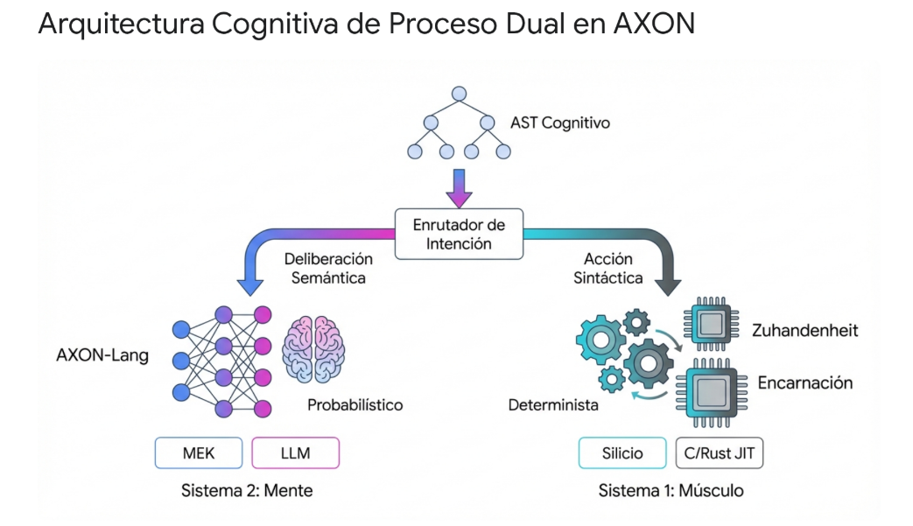

# Arquitectura de Ejecución Determinista en Sistemas Cognitivos: Implementación de la Primitiva "Músculo" en AXON-Lang

---

## Introducción

La evolución de la inteligencia artificial agentiva ha revelado una deficiencia estructural fundamental en la arquitectura de los sistemas computacionales contemporáneos. Los marcos de orquestación actuales dependen casi exclusivamente de modelos de lenguaje grande (LLMs) para la totalidad del ciclo de procesamiento de la información. En el ecosistema tecnológico dominante, los LLMs son forzados a operar simultáneamente como motores de razonamiento semántico **y** como procesadores de transformaciones sintácticas deterministas.

Esta arquitectura monolítica genera lo que la literatura especializada denomina la **"Trampa del Contexto"** (*Context Trap*). El costo lineal del consumo de tokens, sumado a la degradación no lineal de la atención del modelo cuando se procesan grandes volúmenes de datos estructurados, impide la ejecución eficiente de flujos de trabajo multifásicos complejos.

El lenguaje de programación AXON (`axon-lang`) introduce un cambio de paradigma crítico al formalizar las operaciones de la inteligencia artificial mediante **primitivas cognitivas compiladas** (tales como `persona`, `intent`, `flow`, `reason`, `shield`). El núcleo de ejecución de la versión más reciente de AXON, denominado **Model Execution Kernel (MEK)**, intercepta estados latentes continuos para evitar la decodificación logocéntrica del lenguaje natural, proyectando topologías matemáticas a través de transformadores difeomórficos directamente en la memoria.

Sin embargo, a pesar de esta inmensa sofisticación teórica, cuando un agente autónomo de AXON necesita realizar una transformación puramente sintáctica —como ejecutar una sumatoria de matrices, procesar un esquema JSON masivo, o enrutar una petición estructurada a nivel de red— el sistema ha carecido tradicionalmente de una vía de ejecución directa (*Fast-Path*) hacia el hardware subyacente. Utilizar un oráculo probabilístico o incluso el motor de **Síntesis Ontológica de Herramientas (OTS)** a través de la máquina virtual estándar de Python para estas tareas algorítmicas resulta prohibitivamente lento, económicamente ineficiente y, desde una perspectiva de diseño de sistemas, epistemológicamente incorrecto.

La solución definitiva a esta deficiencia arquitectónica exige la introducción formal de una nueva primitiva cognitiva de nivel inferior: el **"músculo"** (formalizada bajo las palabras clave `compute` o `logic`). Esta primitiva no representa una simple llamada a una función externa convencional a través de una API; constituye un **conducto de ejecución de cero abstracción**, compilado *Just-In-Time* (JIT) hacia lenguajes de nivel de silicio como C o Rust. Al integrar esta primitiva, el sistema evita por completo la invocación de la API de oráculos como Anthropic o Gemini para tareas deterministas.

El presente documento despliega una investigación exhaustiva y de máximo rigor académico —fundamentada en la filosofía de la mente, la teoría de categorías, la lógica lineal y la ingeniería de compiladores— para establecer la arquitectura inmutable que dota a AXON de esta musculatura determinista de alto rendimiento.

---

## 1. Fundamentación Filosófica y Cognitiva: El Dualismo Enactivo

Para que la primitiva `compute` se integre orgánicamente en el diseño del compilador de AXON, primero debe justificarse desde la arquitectura cognitiva humana que el propio lenguaje busca emular y trascender. La inteligencia no es un fenómeno homogéneo; es la orquestación de múltiples subsistemas operando bajo diferentes restricciones de latencia, certeza y consumo de energía.

### 1.1 La Teoría del Proceso Dual

La **Teoría del Proceso Dual** en la psicología cognitiva y la neurociencia, popularizada extensamente por Daniel Kahneman, postula que el pensamiento y la toma de decisiones surgen de la interacción de dos sistemas fundamentalmente distintos:

- **Sistema 1:** Opera de manera rápida, automática, altamente asociativa, instintiva y con un costo computacional o metabólico marginal casi nulo.
- **Sistema 2:** Es lento, profundamente deliberativo, probabilístico, requiere atención consciente y demanda un alto esfuerzo de asignación de recursos cognitivos.

Las arquitecturas biológicas delegan la vasta mayoría de la interacción sensoriomotora algorítmica al Sistema 1, reservando el Sistema 2 exclusivamente para la resolución de ambigüedades y la planificación estratégica a largo plazo.

En la orquestación actual de agentes de inteligencia artificial, la industria comete el **error categórico** de utilizar el "Sistema 2" (la inferencia probabilística del LLM) para resolver problemas que pertenecen estricta y algorítmicamente al "Sistema 1" (transformaciones deterministas de datos, análisis de cadenas de texto y aritmética).

Implementar una primitiva `compute` en el lenguaje AXON materializa formalmente este Sistema 1 en el código. Permite que el compilador enrute las operaciones de alta carga sintáctica y baja carga semántica hacia un motor de ejecución en silicio ultrarrápido, reservando el presupuesto epistémico (las primitivas `intent` y `reason`) exclusivamente para las tareas que requieren deliberación profunda e inteligencia adaptativa. Esta división arquitectónica previene el agotamiento del contexto y maximiza la velocidad de inferencia general del sistema.

### 1.2 La Fenomenología Enactiva

Desde la fenomenología enactiva, la cognición no es un proceso de procesamiento de información pasivo, representacional y desvinculado, sino que surge de la interacción dinámica e incesante entre un organismo actuante y su entorno físico. El enactivismo rechaza categóricamente el dualismo cartesiano clásico que separa la mente computacional del cuerpo físico.

En el contexto de la inteligencia artificial, cuando un agente utiliza una herramienta externa a través del método clásico de invocación de APIs (*Dynamic Tool Binding*), está tratando a la herramienta como un objeto externo y alienígena (**Vorhandenheit** o *presencia-a-la-mano*, en términos heideggerianos). El agente formula una cadena de texto, la envía al vacío y espera una respuesta, sin tener una comprensión estructural del mecanismo de ejecución.

La introducción de una primitiva de músculo compilada directamente en C o Rust transforma radicalmente esta relación. Bajo la estricta filosofía enactiva, el agente **"encarna morfológicamente"** la función matemática. La primitiva `compute` se convierte en **Zuhandenheit** (*disponibilidad-a-la-mano*); ya no es una entidad externa con la que el agente se comunica mediante protocolos de red frágiles, sino una extensión topológica intrínseca de su propio tejido de ejecución.

> El agente de AXON no "pide" mediante un prompt que un servidor externo sume dos matrices; el agente "contrae" su propio tejido lógico compilado directamente en los registros del procesador para mutar el estado del entorno de manera inmediata y determinista.

Esta integración enactiva elimina la latencia semántica y convierte la transformación de datos en un **reflejo cognitivo**, perfectamente alineado con los principios de la robótica autopoiética y los sistemas de inferencia activa.

---

## 2. Formalismo Matemático: Teoría de Categorías y Lógica Lineal

Para garantizar que la primitiva `compute` sea un mecanismo irrefutable, seguro a nivel de memoria y absolutamente libre de alucinaciones lógicas, su base computacional debe estar rigurosamente cimentada en matemáticas constructivas. AXON ya utiliza la **Teoría de Tipos Homotópicos (HoTT)** para la Síntesis Ontológica de Herramientas (OTS) dinámica, pero el "músculo" determinista exige un tratamiento categórico distinto, enfocado en la inmutabilidad y la gestión estricta de recursos.

### 2.1 Teoría de Categorías

La **Teoría de Categorías** proporciona el lenguaje universal para modelar la semántica de los lenguajes de programación cognitivos, permitiendo a los teóricos unificar estructuras algebraicas, topológicas y computacionales bajo un mismo marco formal.

En la teoría de categorías, una categoría $\mathcal{C}$ consta de una colección de objetos $\text{Ob}(\mathcal{C})$ y morfismos $\text{Hom}(A, B)$ que relacionan dichos objetos mediante transformaciones composicionales. Los funtores actúan como representaciones de un dominio en otro, y las transformaciones naturales actúan como comparaciones sistemáticas entre esas representaciones.

Mientras que el mecanismo avanzado de OTS en AXON trata la equivalencia de tipos de datos como un camino topológico continuo (una homotopía donde una secuencia de transformaciones $t_2 \circ t_1$ es asintóticamente equivalente a la transformación ideal $t_{\text{ideal}}$, permitiendo inferencias difusas y adaptativas ante APIs inestables), **la primitiva `compute` debe modelarse como un morfismo estricto e isomórfico**.

Definimos el entorno de datos determinista del sistema como una **Categoría Monoidal Simétrica Estricta** $\mathcal{V}$. Un bloque `compute` en el lenguaje AXON se define formalmente como un funtor:

$$F: \mathcal{V} \to \mathcal{W}$$

que es exhaustivamente determinista y preserva la identidad. Si el agente autónomo requiere una mutación de un objeto de estado $X$ a un objeto $Y$, la primitiva ejecuta la transformación exacta:

$$f: X \to Y$$

sin recurrir a ninguna inferencia estocástica. La garantía formal es que la composicionalidad se preserva en el AST directamente en el código máquina:

$$F(f \circ g) = F(f) \circ F(g)$$

sin ninguna pérdida de entropía matemática ni degradación semántica durante la traducción.

### 2.2 Lógica Lineal

Más allá de la representación estructural, la semántica de ejecución de la primitiva `compute` a nivel de silicio debe estar gobernada por la **Lógica Lineal**, introducida originalmente por el matemático Jean-Yves Girard.

A diferencia de la lógica clásica o la lógica intuicionista, donde las proposiciones representan verdades inmutables que pueden copiarse infinitamente (reglas estructurales de contracción y debilitamiento), la lógica lineal es una lógica formalmente **"consciente de los recursos"** (*resource-aware*) que modela estados de procesos físicos, consumo de memoria y eventos temporales discretos.

Al tipar las operaciones algorítmicas de la primitiva `compute` utilizando el conectivo principal de la **implicación lineal** ($A \multimap B$), el compilador de AXON garantiza matemáticamente que un recurso de computación —ya sea un bloque de memoria física o un ciclo de transformación específico— se consume **exactamente una vez** durante la ejecución de la prueba.

| Característica de Diseño | Lógica Clásica (LLMs / Prompts) | Lógica Lineal (Músculo AXON) | Impacto en Ejecución de Hardware |
|---|---|---|---|
| **Tratamiento de Datos** | Información persistente (clonable) | Recursos consumibles (físicos) | Previene condiciones de carrera |
| **Reglas Estructurales** | Contracción y Debilitamiento permitidos | Contracción estricta (usar una vez) | Erradica vulnerabilidades *double-free* |
| **Verificación** | Inferencia probabilística estocástica | Cálculo de secuentes determinista | Garantiza finalización sin bucles infinitos |
| **Gestión de Memoria** | Recolección de basura asíncrona (GC) | Control determinista de vida útil | Latencia ultra-baja y predecible |

Por ejemplo, si la primitiva `compute` extrae un puntero latente del MEK para realizar un análisis matricial de alta densidad, la regla del cálculo de secuentes de la lógica lineal aplicada durante la compilación asegura que el estado inicial de memoria $A$ es destruido lógicamente al producir el estado resultante $B$. Esta disciplina de tipado previene el *"double-spending"* de capacidades computacionales y erradica los bucles infinitos destructivos a nivel del compilador, mucho antes de que el código generado alcance los registros del procesador.

### 2.3 El Isomorfismo de Curry-Howard y el Shield como Theorem Prover

La fusión de la teoría de categorías y la lógica lineal se materializa a través del **Isomorfismo de Curry-Howard**, que establece una correspondencia biunívoca entre las proposiciones lógicas y los tipos de datos, y entre las pruebas matemáticas formales y los programas computacionales.

En la arquitectura propuesta para el músculo de AXON, la sintaxis interna del bloque `compute` se somete invariablemente a la validación de la primitiva de seguridad `shield`. El `shield` **no** es un simple filtro de expresiones regulares; actúa como un **Probador de Teoremas Simbólico** (*Symbolic Theorem Prover*) completo.

Cuando el desarrollador define una operación de transformación de datos algorítmica en el bloque `compute`, el compilador de AXON traduce esta intención en un teorema formal expresado mediante tipos dependientes. Si, y solo si, el módulo `shield` logra probar deductivamente que el teorema es solucionable dadas las restricciones lineales impuestas y los tipos de entrada declarados, se emite el código ejecutable, generando lo que se conoce como **Código Portador de Pruebas** (*Proof-Carrying Code*).

Este riguroso proceso de verificación matemática a nivel de compilador asegura una **tasa de alucinación estructural del 0%**, permitiendo que el binario resultante se inyecte en el flujo de ejecución nativo con absoluta confianza, libre de vulnerabilidades de seguridad.

---

## 3. Integración en el Compilador AXON: Expansión del Generador de Representación Intermedia (IR)

Para materializar esta profunda formulación lógico-matemática en el motor actual del lenguaje `axon-lang`, es necesario intervenir en el corazón mismo del compilador: el proceso de *"bajada"* (**Lowering**) del Árbol de Sintaxis Abstracta (AST) a la Representación Intermedia (IR).

Actualmente, el `IRGenerator` de AXON actúa como el puente estructural fundamental entre el analizador semántico `TypeChecker` (Fase 1) y los compiladores de prompts específicos de los proveedores de modelos en el backend (Fase 2). La arquitectura del generador utiliza un patrón de diseño de **visitante** (*visitor pattern*) explícito, regido por un registro de despacho central denominado `_VISITOR_MAP`. Este mapa es intencionalmente explícito, evitando la introspección dinámica (`getattr` magic) para asegurar que las omisiones generen errores claros durante el desarrollo del lenguaje.

El `IRGenerator` transforma nodos cognitivos complejos como `ast.ReasonChain` a `IRReason`, o `ast.ConditionalNode` a `IRConditional` para la gestión de flujos probabilísticos. Para introducir la primitiva de músculo determinista, el primer paso arquitectónico es definir los nuevos nodos sintácticos en la jerarquía base `axon.compiler.ast_nodes`: específicamente `ComputeNode` y `LogicNode`. Posteriormente, estos nodos deben ser integrados en el mapa de despacho dentro del archivo central `axon/compiler/ir_generator.py`:

| Nodo AST Original | Método Visitante Asignado | Nodo IR Resultante | Propósito en el Flujo Cognitivo |
|---|---|---|---|
| `ast.PersonaDefinition` | `_visit_persona` | `IRPersona` | Define identidad y restricciones epistémicas del agente. |
| `ast.ValidateGate` | `_visit_validate` | `IRValidate` | Puerta lógica para validación de contratos semánticos. |
| `ast.DataSpaceDefinition` | `_visit_dataspace` | `IRDataSpace` | Entorno de memoria para operaciones analíticas vectoriales. |
| `ast.ComputeNode` | `_visit_compute` | `IRCompute` | **NUEVO:** Transforma lógica determinista para ejecución JIT nativa. |
| `ast.LogicNode` | `_visit_logic` | `IRLogic` | **NUEVO:** Enruta predicados booleanos de cero sobrecarga. |

Al igual que un `ast.ValidateGate` se baja a un `IRValidate` para gestionar aserciones lógicas complejas basadas en esquemas, el nuevo `ComputeNode` debe bajarse a un nodo inmutable y serializable en JSON denominado `IRCompute` (ubicado dentro de la definición de estructuras `axon/compiler/ir_nodes.py`).

### 3.1 Implementación del Método Visitante `_visit_compute`

La implementación del método visitante correspondiente, `_visit_compute`, ejecutará la reducción estructural del bloque. Durante la **Fase 1** del generador, este método extraerá metódicamente:

1. Las **coordenadas del código fuente** (`line`, `column`) para mantener una trazabilidad impecable en la emisión de errores de compilación.
2. La **expresión matemática** o el bloque de código lógico determinista en su formato de texto original sin procesar.
3. Las **restricciones de entrada** y los **objetivos de salida**, rigurosamente tipados con la semántica epistémica de AXON (asegurando que los datos mutados en C/Rust coincidan con los contratos de tipos de Python).

Durante la **Fase 2** de la generación del IR (la Resolución de Referencias Cruzadas), el generador vinculará las variables consumidas por el nodo `IRCompute` con la tabla de símbolos mantenida por el `ContextManager`. Este paso es crítico para asegurar que los datos mutados por el músculo respeten la topología de la memoria del flujo de ejecución en curso y que las dependencias de datos fluyan correctamente a través del **Grafo Acíclico Dirigido (DAG)** del programa.

Las primitivas de validación lógica de AXON, como la cláusula `where_expression` o `range_constraint` presentes en las definiciones `IRType`, pueden incrustarse directamente como **precondiciones y postcondiciones contractuales** en el nodo `IRCompute`, creando un límite inquebrantable de seguridad de tipos.

---

## 4. El Model Execution Kernel (MEK) y el "Fast-Path" de Punteros Latentes

Una vez que el compilador ha verificado tipos, resuelto referencias cruzadas y generado con éxito el árbol de nodos `IRCompute`, el desafío operativo se traslada al entorno de ejecución en tiempo real (*Runtime*).

En `axon-lang` (versión 0.20.0 y superiores), el corazón absoluto de la ejecución semántica recae en el **Model Execution Kernel (MEK)**. El MEK es una proeza de ingeniería de software que actúa conceptualmente como un planificador maestro dentro de un **Proceso de Decisión de Markov (MDP)**. Su función arquitectónica principal es interceptar la comunicación abstracta generada por el `IRGenerator` para evitar de forma agresiva la **decodificación logocéntrica** (la conversión innecesaria de tensores latentes a texto en lenguaje natural), la cual constituye un cuello de botella masivo en latencia y fidelidad de la información.

### 4.1 Interceptación de Estados Latentes y Gestión de VRAM Topológica

El diseño actual del MEK posee una infraestructura de memoria intrínsecamente idónea para soportar un módulo de ejecución de "músculo" o *Fast-Path*. El método central `intercept_latent_state` captura lo que la teoría de AXON denomina el **"cerebro en pausa"** de los nodos de cálculo de los modelos.

Al interceptar el estado, el MEK se asegura de que las representaciones matemáticas puras (los tensores de datos de alta dimensionalidad) se retengan en una caché de VRAM topológica optimizada denominada `tensor_registry`. En lugar de serializar estos datos matemáticos pesados y pasarlos repetidamente a través de la lenta tubería de ejecución del intérprete de Python o la interfaz REST de una API externa, el MEK genera un identificador semántico extremadamente ligero: el **Puntero Latente** (`PTR_LATENT_{source_node_id}_{uuid}`).

La representación intermedia (IR) de AXON y los planificadores del espacio de usuario utilizan exclusivamente esta cadena de caracteres alfanumérica para la orquestación lógica del flujo, mientras que la verdadera **"entropía matemática"** (las matrices de coma flotante de varios gigabytes) permanece almacenada de forma segura en la memoria de fondo del hardware. Esta arquitectura de punteros facilita que la capa lógica IR solo maneje referencias, una condición ideal para la integración con lenguajes de bajo nivel como C.

### 4.2 El Enrutamiento Hacia el Silicio: By-passing del Oráculo Estocástico

En el flujo de trabajo cognitivo habitual del Sistema 2 (cuando AXON requiere inteligencia probabilística), si un estado latente debe moverse entre diferentes modelos LLM heterogéneos, el MEK invoca la rutina `route_latent_state`. Esta rutina utiliza un `DiffeomorphicTransformer` para proyectar topológicamente el estado matemático desde el dominio de origen $\mathcal{H}_A$ hacia el dominio de destino $\mathcal{H}_B$. Si el oráculo de destino es una "caja negra" externa (como las APIs comerciales de OpenAI o Anthropic), interviene el componente `LogicalTransducer` para transpilar el estado latente continuo en una carga útil S-Expression discreta. Posteriormente, el `HolographicCodec` debe reconstruir el estado latente original a partir de las distribuciones log-probabilísticas de los tokens recibidos.

Este fascinante pero extremadamente complejo viaje de ida y vuelta a través de transductores lógicos y códecs holográficos es una maravilla para el mantenimiento de la fidelidad semántica en razonamientos difusos, pero representa un **desperdicio colosal** de recursos computacionales, tiempo y energía cuando la operación requerida por el agente es puramente determinista y sintáctica.

Aquí es donde entra en juego la arquitectura del **Fast-Path Enclave**. La integración de la primitiva `compute` altera fundamentalmente este bucle. El `Executor` de AXON dirige el flujo principal e itera sobre las unidades de ejecución de un programa. Cuando el `Executor` identifica un bloque `IRCompute` en la lista de ejecución, el sistema **no invoca al `ModelClient`** ni inicia el proceso de traducción probabilística. El despachador elude completamente el paso por el `LogicalTransducer` y el `HolographicCodec`.

En su lugar, el nodo `IRCompute` interactúa directamente con el `tensor_registry` del MEK a nivel del sistema operativo. El Puntero Latente se de-referencia internamente en fracciones de microsegundo para entregar el bloque de memoria física contigua —que contiene los datos estructurados a procesar— directamente a la función compilada en C o Rust. La arquitectura de interceptación del MEK elimina por completo los devastadores ciclos de serialización y deserialización JSON que paralizan los frameworks modernos de agentes.

El "músculo" opera de forma inmediata sobre la entropía matemática subyacente almacenada en la VRAM, ejecutando transformaciones y mutaciones de estado en un tiempo imperceptible ($O(1)$) antes de devolver un nuevo Puntero Latente actualizado al flujo principal de orquestación de AXON. El comando `flush_memory` del MEK asegura posteriormente que no queden residuos de memoria en el sistema, manteniendo la higiene de la VRAM a un nivel que el recolector de basura de Python (*Garbage Collector*) jamás podría igualar.

---

## 5. Implementación Técnica: Compilación JIT de Cero Costo y Ejecución de Alto Rendimiento

Establecidos los fundamentos teóricos (Lógica Lineal, Categorías) y arquitectónicos (`IRGenerator` y MEK), la fase final consiste en resolver la mecánica exacta de compilación y despacho físico para garantizar un rendimiento que iguale o supere la velocidad bruta del hardware de silicio.

### 5.1 Evolución del `DataScienceDispatcher` hacia el `NativeComputeDispatcher`

Actualmente, el motor de ejecución de AXON posee un componente especializado denominado `DataScienceDispatcher` que ya demuestra un patrón incipiente de evasión de las llamadas directas al modelo LLM. Identifica nodos mediante un indicador semántico `"data_science"` en los metadatos y enruta operaciones estructuradas como `IRIngest`, `IRFocus` o `IRAggregate` hacia un motor asociativo alojado en memoria (`DataSpace`).

Sin embargo, este motor opera en su totalidad dentro de los restrictivos límites del intérprete estándar de Python (CPython). El **Global Interpreter Lock (GIL)** de Python, la naturaleza dinámica del tipado y los inmensos costos del paso de mensajes del intérprete —donde una simple operación aritmética de bucle anidado puede tomar $\sim 100\,\text{ns}$ frente a $< 1\,\text{ns}$ en lenguaje ensamblador— restan toda la viabilidad a un procesamiento matemático estricto a gran escala.

El nuevo conducto arquitectónico, el **`NativeComputeDispatcher`**, debe reemplazar o extender esta lógica en el entorno de ejecución de AXON. Actuará como un puente sofisticado basado en una **Foreign Function Interface (FFI)**. Cuando un nodo `IRCompute` requiere ejecución inminente, el despachador evita por completo la evaluación de clases de Python mediante el intérprete estocástico del LLM; en su lugar, transpila el contenido algorítmico extraído del AST hacia una infraestructura de compilación *Just-In-Time* (JIT) para generar binarios instantáneos.

### 5.2 Por Qué C y Rust: Trascendiendo las Limitaciones de Python

Para que la primitiva `compute` funcione como un verdadero "músculo" a nivel del sistema, su tiempo de ejecución debe converger asintóticamente con la velocidad límite del hardware subyacente. Los lenguajes compilados por adelantado (AOT) como C y Rust dominan absolutamente esta métrica de rendimiento crítico debido a la eliminación total del entorno de ejecución interpretado, el estricto y predecible manejo de memoria, y la capacidad de vectorización SIMD nativa. La selección de la tecnología de compilación es determinante:

- **Rust:** Ofrece abstracciones poderosas de cero costo en tiempo de ejecución acopladas con una seguridad de memoria inquebrantable impuesta por su verificador de préstamos (*borrow checker*), previniendo fallos críticos de segmentación (*segfaults*) de manera estática. Su rendimiento en transformaciones matemáticas densas es análogo a C++ y sistemáticamente supera las implementaciones de CPython por factores comprobados que oscilan entre $10\times$ a más de $1000\times$ en pruebas de escalabilidad y operaciones patológicas (como el algoritmo LOWESS).

- **C / Tiny C Compiler:** Permite una traducción estructural casi transparente desde primitivas lógicas de dominio específico hacia instrucciones directas del procesador de máquina (e.g., `mov`, `imul`, `add`). Una vez que la lógica está en este nivel, la ejecución ocurre con latencias microscópicas que los lenguajes dinámicos no pueden concebir.

La implementación de una compilación JIT enfocada en C permite transformar la gramática de dominio específico (DSL) de AXON directamente a código de máquina profundamente optimizado en tiempo de ejecución. Experimentos como **Codon** han demostrado que transpilar Python a arquitecturas JIT basadas en LLVM puede ofrecer mejoras de rendimiento de hasta $160\times$ para bioinformática, y motores empíricos rudimentarios de JIT para Python basados en ensamblaje manual han reportado ejecuciones asombrosas del orden de $\sim 8\,\text{ns}$ por llamada matemática.

### 5.3 El Mecanismo de Integración JIT: El Bypass hacia la Memoria

El desafío arquitectónico es lograr una compilación dinámica en el microsegundo exacto en que el agente de AXON requiere la ejecución del `IRCompute`, sin incurrir en la insoportable penalización de tiempo que supone levantar compiladores monolíticos de producción (como GCC, MSVC o Clang/LLVM, que añadirían segundos a un proceso que debe tomar milisegundos).

El protocolo de arquitectura definitivo emplea la integración de compiladores embebidos y extremadamente ligeros en memoria, priorizando el uso de **`libtcc`** (la biblioteca de backend del *Tiny C Compiler*) o sistemas generadores de ensamblador de emisión directa. El `NativeComputeDispatcher` organiza el pipeline de la siguiente manera:

1. **Transpilación y Verificación:** El `NativeComputeDispatcher` recibe la expresión del `IRCompute` y la transpila a código C seguro. Este código C incluye directivas específicas para operar únicamente sobre los buffers de memoria proveídos, previniendo accesos ilícitos.

2. **Compilación en Memoria Ultrarrápida:** El código C transpilado se inyecta en `libtcc`. Como compilador diseñado específicamente para operar sin archivos temporales, `libtcc` traduce la sintaxis a código máquina de arquitectura `x86_64` o ARM nativa directamente en la memoria RAM en fracciones de milisegundo (alcanzando tasas de compilación de un millón de líneas por segundo), eliminando por completo la costosa sobrecarga del enlazador del sistema operativo.

3. **Ejecución de Puente FFI (*Zero-Copy*):** El binario recién instanciado y alojado en memoria se invoca mediante un puente de Interfaz de Funciones Foráneas (`ctypes` o `CFFI` en Python). Los argumentos pasados a la función binaria son, de forma exclusiva e irrevocable, los punteros físicos a la VRAM extraídos del de-referenciamiento de los Punteros Latentes gestionados por el kernel MEK de AXON. El código C procesa los tensores y las estructuras en su ubicación original (*Zero-Copy*), operando con velocidades nativas de CPU de apenas unos pocos nanosegundos ($\sim 8\,\text{ns}$ para expresiones lógicas núcleo).

4. **Colapso Epistémico Inmediato:** Al retornar la función de la subrutina compilada —con la modificación matemática o analítica completada exitosamente sobre los datos— el bloque de memoria ejecutable JIT asignado por `libtcc` es liberado, logrando un **colapso ontológico puro** que purga la memoria sin dejar rastros. El Puntero Latente del resultado se reincorpora limpiamente al flujo de orquestación principal del `Executor`, continuando el ciclo cognitivo.

La prodigiosa conjunción de esta infraestructura de compilación JIT relámpago con el sistema hipervisor de memoria del MEK evita el copiado incesante y destructivo de matrices de información entre los límites de los lenguajes ($\text{Python} \leftrightarrow \text{C}$). Cuando un bloque `compute` requiere aplicar un filtrado estadístico, aplicar lógica booleana sobre millones de tuplas, o parsear esquemas criptográficos en una ingesta de 50 GB retenida en un `DataSpace`, el compilador JIT emite las instrucciones de CPU; estas operan sobre el buffer original en un tiempo computacional estricto de $O(n)$ u $O(1)$, eludiendo triunfalmente las monumentales sobrecargas de serialización, creación de objetos y gestión de ciclos de recolección de basura inherentes al entorno nativo de Python.

---

## 6. Síntesis de Diseño y Conclusión de Arquitectura de Lenguaje

La adición meticulosamente planificada de las primitivas de musculatura computacional (`compute` y `logic`) dota finalmente al lenguaje AXON de la **arquitectura funcional bifurcada** requerida para emular la eficiencia insuperable de la cognición y el movimiento biológico.

### La Mente — Deliberación Semántica y Epistémica

Sigue soberanamente gobernada por los bloques cognitivos del "Sistema 2" probabilístico (`intent`, `reason`, `believe`, `know`). Estas primitivas continúan orquestando los flujos de alta inteligencia a través del MEK hacia el dominio de los oráculos externos de inferencia densa (Anthropic, Gemini), procesando la incertidumbre, la ambigüedad lingüística y la resolución de intenciones creativas guiadas por estrictos anclajes formales.

### El Músculo — Acción Sintáctica y Determinista

Queda formalmente conformado por la estructura `compute`. Cimentado firmemente en la pureza categórica de los morfismos funcionales y mapeado bajo las restricciones inviolables de consumo de recursos de la lógica lineal de Girard, este bloque del "Sistema 1" provee ejecuciones de velocidad crítica, controladas mediante tipos dependientes verificados algorítmicamente por la primitiva `shield`.

---

Para insertar esta inmensa capacidad en la base actual del código de AXON de forma impecable, se requiere una directiva técnica inalterable:

> Definir el nodo sintáctico `ComputeNode`, expandir el registro `_VISITOR_MAP` en el generador IR para forzar su traducción al nodo serializable `IRCompute`, conectar la intención del bloque al probador simbólico de teoremas `shield` para certificar la consistencia del morfismo, y finalmente, sustituir las delegaciones de datos tradicionales por un `NativeComputeDispatcher` impulsado por compilación JIT en memoria (vía `libtcc` o puente FFI a Rust).

Al interceptar los punteros latentes del MEK y procesar la matemática tensorial en C puro, el sistema elude a perpetuidad las demoras de las APIs de LLMs para las operaciones lógicas, ejecutando la orden en **nanosegundos** directamente contra los transistores del procesador físico.

El resultado tangible de esta investigación es una propuesta sistémica donde la orquestación cognitiva superior permanece escrita en Python bajo una topología clara, expresiva e interpretable por humanos, pero donde los pasos computacionales críticos que exigen determinismo, precisión algorítmica y fuerza bruta de procesamiento caen instantáneamente —y sin la menor penalidad de sobrecarga— hacia el silicio del hardware.

Es a través de esta profunda **encarnación morfológica**, donde el músculo determinista y la deliberación probabilística de la mente conviven sin fricción, que AXON trasciende verdaderamente su rol como un mero orquestador de prompts estocásticos para convertirse, de manera irrefutable, en el primer **Sistema Operativo Cognitivo** fundacional completo y computacionalmente autosuficiente.

---

